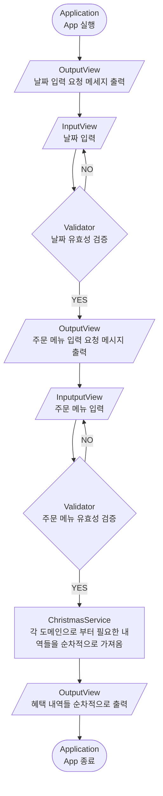
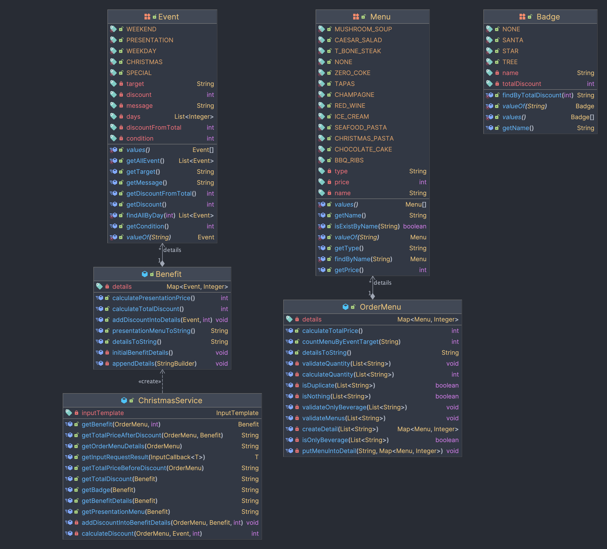
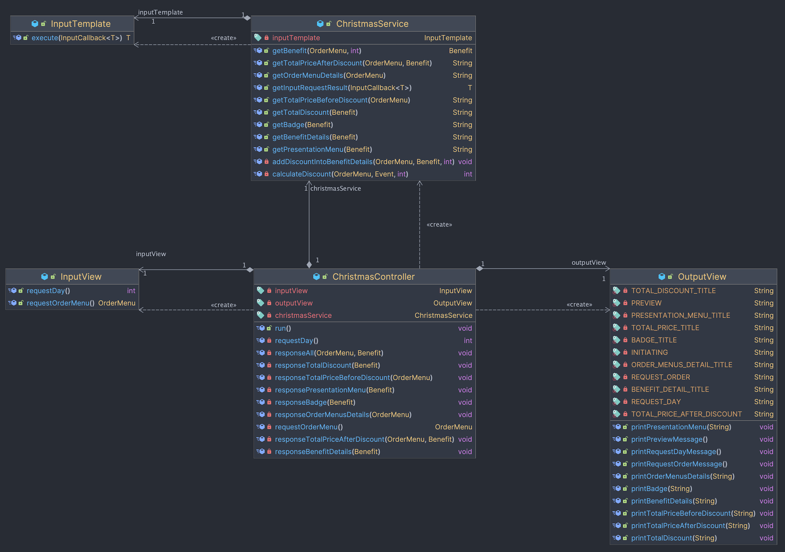
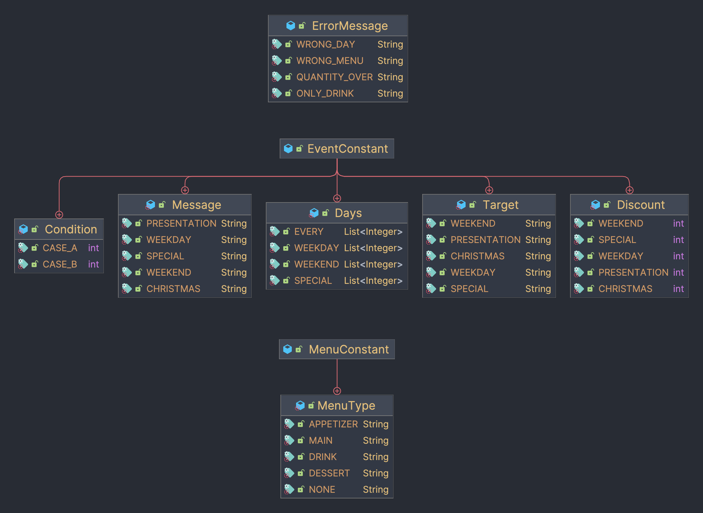

# 🎄크리스마스 프로모션 App🎄

## 🔍 진행과정

1. 방문을 희망하시는 날짜를 입력해주세요

- 날짜는 숫자만 입력해주세요 (공백은 포함 되어도 괜찮습니다.)

```
안녕하세요! 우테코 식당 12월 이벤트 플래너입니다.
12월 중 식당 예상 방문 날짜는 언제인가요? (숫자만 입력해 주세요!)
3
```

2. 주문할 메뉴를 갯수와 함께 입력해주세요

- `메뉴이름-메뉴갯수` 형식을 꼭 지켜주세요 (공백은 포함 되어도 괜찮습니다.)
- 메뉴는 꼭 1개 이상 주문해주세요(e.g. 해산물파스타-1 [O] // 해산물파스타-0 [X])
- 각 메뉴의 갯수 합을 20개 이하로 주문해주세요(e.g. 바비큐립-5,레드와인-5 [O] // 바비큐립-11, 레드와인-10 [X])
- 음료만 주문할 수 없어요.
- 메뉴판에 없는 메뉴는 주문할 수 없어요
- 중복된 메뉴는 주문할 수 없어요(e.g. 해산물파스타-2,해산물파스타-1 [X])

```
티본스테이크-1,바비큐립-1,초코케이크-2,제로콜라-1
```

3. 주문 및 혜택을 확인해주세요

- 주문 메뉴 부터 시작해서 총 7가지의 타이틀에 해당하는 내역들이 맞는지 확인해주세요.
- 할인 후 예상 결제 금액은 **증정 이벤트 할인을 제외**한 금액이에요

```
<주문 메뉴>
티본스테이크 1개
바비큐립 1개
초코케이크 2개
제로콜라 1개
 
<할인 전 총주문 금액>
142,000원
 
<증정 메뉴>
샴페인 1개
 
<혜택 내역>
크리스마스 디데이 할인: -1,200원
평일 할인: -4,046원
특별 할인: -1,000원
증정 이벤트: -25,000원
 
<총혜택 금액>
-31,246원
 
<할인 후 예상 결제 금액>
135,754원
 
<12월 이벤트 배지>
산타
```

## 🎯 기능 구현 목록

- ### 메뉴판(Menu)
    - [X] 판매 중인 메뉴들을 열거하여 저장할 수 있는 곳 입니다.
    - [X] 각 메뉴는 타입과 가격 정보를 갖고있습니다.
    - [X] 메뉴판에 메뉴의 존재여부를 확인합니다.
- ### 주문(OrderMenu)
    - [X] 사용자 입력한 주문 내역들을 저장합니다.
    - [X] 예외처리
        - 메뉴판에 없는 메뉴를 입력한 경우
        - 중복 메뉴를 입력한 경우
        - 음료 메뉴만 입력한 경우
        - 메뉴 갯수의 합이 20을 초과한 경우
    - [X] 사용자에게 보여줄 주문 내역을 만듭니다.
    - [X] 주문한 총금액을 계산합니다.
    - [X] 이벤트 대상인 메뉴의 갯수를 계산합니다.
- ### 이벤트(Event)
    - [X] 진행 중인 이벤트들을 열거하여 저장할 수 있는 곳 입니다.
    - [X] 각 이벤트는 해당하는 정보들을 갖고 있습니다.
        - 조건(주문 총 금액으로 결정됨)
        - 적용 날짜
        - 대상 메뉴 또는 증정품
        - 할인 금액
        - 주문 총 금액에서 할인 금액
        - 할인 시 메세지
    - [X] 입력된 날짜에 해당하는 모든 이벤트들을 찾습니다.
    - [X] 저장되어 있는 모든 이벤트들을 반환합니다.
- ### 혜택(Benefit)
    - [X] 혜택 받은 내역들을 저장하는 곳 입니다.
    - [X] 할인 받은 총 금액을 계산합니다.
    - [X] 이벤트 별 할인 받은 금액을 추가합니다.
    - [X] 사용자에게 보여줄 혜택 내역을 만듭니다.
    - [X] 증정 이벤트 할인 가격을 계산합니다.
    - [X] 사용자에게 보여줄 증정 메뉴 내역을 만듭니다.
- ### 배지(Badge)
    - [X] 이벤트 배지들을 열거하여 저장할 수 있는 곳 입니다.
    - [X] 총 할인 금액으로 해당하는 배지를 찾습니다.
- ### 크리스마스 서비스(ChristMasService)
    - [X] 주문 메뉴와 날짜에 맞게 혜택 내역을 작성합니다.
    - [X] 증정 메뉴 가격을 가져옵니다.(할인 후 예상 결제 금액을 계산을 위해 사용)
    - [X] 사용자에게 보여줄 항목들을 가져옵니다.
        - 주문 메뉴 내역
        - 할인 전 총주문 금액
        - 증정 메뉴
        - 혜택 내역
        - 총혜택 금액
        - 할인 후 예상 결제 금액
        - 12월 이벤트 배지
- ### View(InputView / OutputView)
    - #### InputView
        - [X] 사용자에게 메뉴와 날짜를 받습니다.
        - [X] 예외처리
            - `메뉴이름-메뉴갯수` 형식이 아닌경우
            - 각 메뉴의 갯수가 1이상이 아닌 경우
            - 날짜가 숫자가 아닌 경우
            - 날짜가 1과31 사이가 아닌 경우
    - #### OutputView
        -[X] 요구사항에 맞게 내역들을 출력합니다.
            - 이니셜 멘트
            - 날짜 요청 메시지 / 주문 메뉴 요청 메시지
            - 주문 메뉴 내역
            - 할인 전 총주문 금액
            - 증정 메뉴
            - 혜택 내역
            - 총혜택 금액
            - 할인 후 예상 결제 금액
            - 12월 이벤트 배지

## 🗺️ 플로우 차트



## 🧩 클래스 다이어그램

- ### domain



---

- ### controller



---

- ### constant

